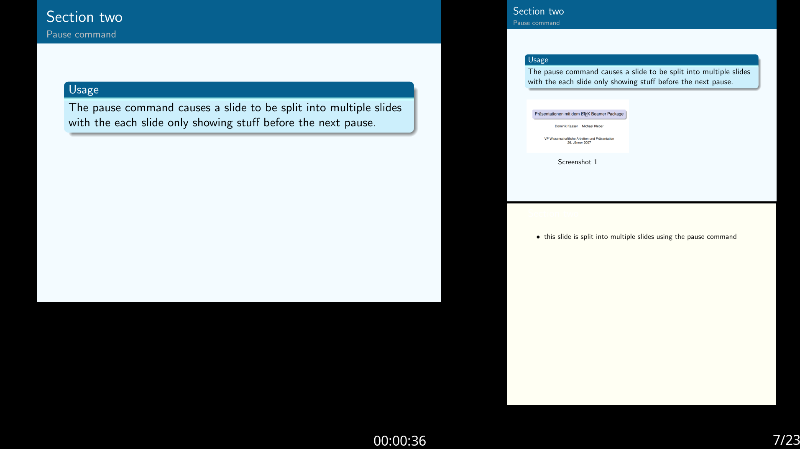
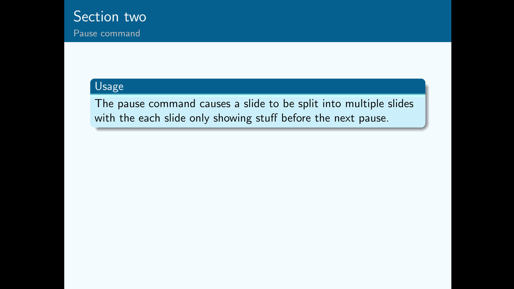

## Handout / Presentation Mode

Depending on first lines in config.tex handout or presentation mode is active.

In handout mode slides are printed on one page and notes are not shown.

In presentation mode slides include "animation" and notes are shown on the right if activated. The produced pdf can be used with pdfpc (present.sh) to present with powerpoint like notes and preview.

### Presenter screen

### Beamer / audience screen

